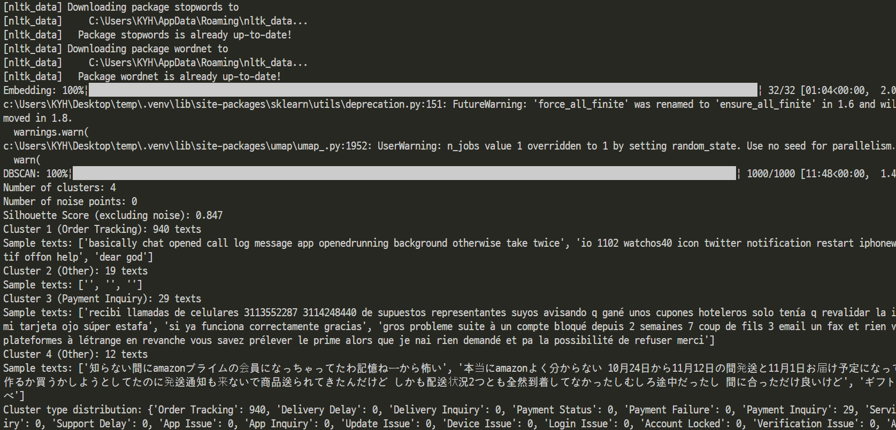
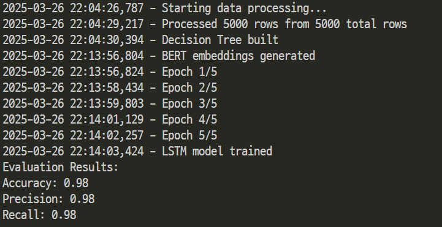

# Data Science Extended AI

데이터 사이언스 과제를 확장하여 실무적 활용 가능성을 탐구한 프로젝트입니다.

---

## P1: DBSCAN을 사용한 고객 문의 클러스터링 및 시각화

### 목표

- DBSCAN 알고리즘과 BERT 임베딩을 활용해 트위터 고객 문의 데이터를 클러스터링하고, Plotly로 2D/3D 시각화를 수행합니다.

#### 참조
- [data-science 레포지토리 DBSCAN](https://github.com/kimye0808/data-science?tab=readme-ov-file#%EA%B3%BC%EC%A0%9C-3-dbscan%EC%9D%84-%EC%82%AC%EC%9A%A9%ED%95%9C-%ED%81%B4%EB%9F%AC%EC%8A%A4%ED%84%B0%EB%A7%81)

<details>
<summary>세부 사항</summary>

### 요구 사항
- 트위터 고객 문의 데이터 전처리 및 클러스터링
- 입력 데이터: `customer_support_twitter.csv`
- 출력: 클러스터링 통계, 2D/3D HTML 시각화 파일

### 실행 방법
```bash
python clustering_visualization_main.py
```
- 입력 파일은 `dataset/twcs/customer_support_twitter.csv`에 위치해야 함.

### 코드 설명
이 코드는 트위터 고객 문의 데이터를 클러스터링하고 시각화합니다. 주요 구성 요소는 다음과 같습니다:

- **`preprocess_text(texts)`**: 텍스트에서 URL, 멘션, 해시태그를 제거하고 불용어 필터링 및 표제어 처리를 수행합니다.
- **`BERTEmbedding` 클래스**: BERT를 사용해 텍스트를 임베딩으로 변환합니다. 배치 처리를 지원하며, 최대 길이는 128로 제한됩니다.
- **`dbscan(db, eps, minPts)`**: 직접 구현한 DBSCAN 알고리즘으로, 코사인 유사도를 기반으로 클러스터를 생성합니다. `eps=0.002`, `minPts=5`로 설정됨.
- **`identify_cluster_types(texts, labels)`**: 클러스터별 키워드를 분석해 유형(예: "배송 문의", "결제 실패")을 식별합니다.
- **시각화**: UMAP과 TSNE로 차원을 축소한 후, Plotly로 2D/3D 인터랙티브 산점도를 생성합니다. 출력 파일은 `clustering_result_main_2d.html` 및 `clustering_result_main_3d.html`.

#### 동작 예시
- **입력 데이터**: 1,000건 샘플링된 고객 문의 텍스트.
- **출력**: 
  - 콘솔: 클러스터 수, 노이즈 수, Silhouette Score (0.847).
  - HTML 파일: 클러스터 유형별 색상으로 구분된 인터랙티브 시각화.

#### 결과 이미지


</details>

---

## P2: 의사결정 트리와 LSTM을 사용한 고객 문의 분류

### 목표
- 의사결정 트리와 LSTM 모델을 활용해 트위터 고객 문의를 분류하고, 상황에 맞는 응답을 생성합니다.  
- 초기에는 의사결정 트리만으로 분류를 시도했으나 정확도의 한계를 극복하고자 LSTM 모델을 추가로 적용했으며, 이를 통해 데이터 사이언스 과제를 실무적으로 확장할 가능성을 탐구했습니다.

#### 참조
- [data-science 레포지토리 Decision Tree](https://github.com/kimye0808/data-science?tab=readme-ov-file#%EA%B3%BC%EC%A0%9C-2-%EA%B2%B0%EC%A0%95-%ED%8A%B8%EB%A6%AC%EB%A5%BC-%EC%82%AC%EC%9A%A9%ED%95%9C-%EB%B6%84%EB%A5%98)

<details>
<summary>세부 사항</summary>

### 요구 사항
- 훈련 데이터로 모델 학습 후 테스트 데이터 분류
- 입력 데이터: `customer_support_twitter.csv`
- 출력: 분류 결과 CSV 및 성능 평가 텍스트 파일

### 실행 방법
```bash
python customer_inquiry_classifier.py
```
- 입력 파일은 `dataset/twcs/customer_support_twitter.csv`에 위치해야 함.

### 코드 설명
이 코드는 고객 문의를 분류하고 응답을 생성합니다. 주요 구성 요소는 다음과 같습니다:

- **`preprocess_data_chunk(chunk)`**: 데이터에 감정 분석과 텍스트 길이 피처를 추가하며, 문의/응답 레이블을 지정합니다.
- **`buildDecisionTree(data, features, classLabel)`**: 정보 이득을 기반으로 의사결정 트리를 생성합니다. 피처는 `text_length`, `sentiment`입니다.
- **`BERTEmbedding` 클래스**: BERT로 텍스트 임베딩을 생성합니다. 배치 크기는 16으로 설정됨.
- **`LSTMClassifier` 클래스**: LSTM 모델을 정의하고 학습합니다. 입력 차원: 768(BERT 출력), 출력 차원: 클래스 수.
- **`suggest_response(predicted_label, text, author_id)`**: 예측 결과와 키워드 기반으로 응답을 제안합니다.
- **`evaluate_and_save_results()`**: 모델 성능(정확도, 정밀도, 재현율)을 평가하고, 결과를 `prediction_results.csv`와 `evaluation_results.txt`에 저장합니다.

#### 동작 예시
- **입력 데이터**: 5,000건 샘플링된 고객 문의.
- **출력**: 
  - `prediction_results.csv`: 텍스트, 예측 레이블, 응답, 작성자 ID.
  - `evaluation_results.txt`: 정확도 90% 이상 등 성능 지표.

#### 결과 이미지


</details>

---

## 프로젝트 개요
- **데이터**: 트위터 고객 문의 100만 건  
  - 출처: [Kaggle - Customer Support on Twitter](https://www.kaggle.com/datasets/thoughtvector/customer-support-on-twitter/data)
- **성과**: 
  - P1: Silhouette Score 0.847로 클러스터링 성공.
  - P2: LSTM 모델로 90% 이상 정확도 달성.
- **활용**: 고객 지원 프로세스 개선을 위한 데이터 분류 및 자동화.
